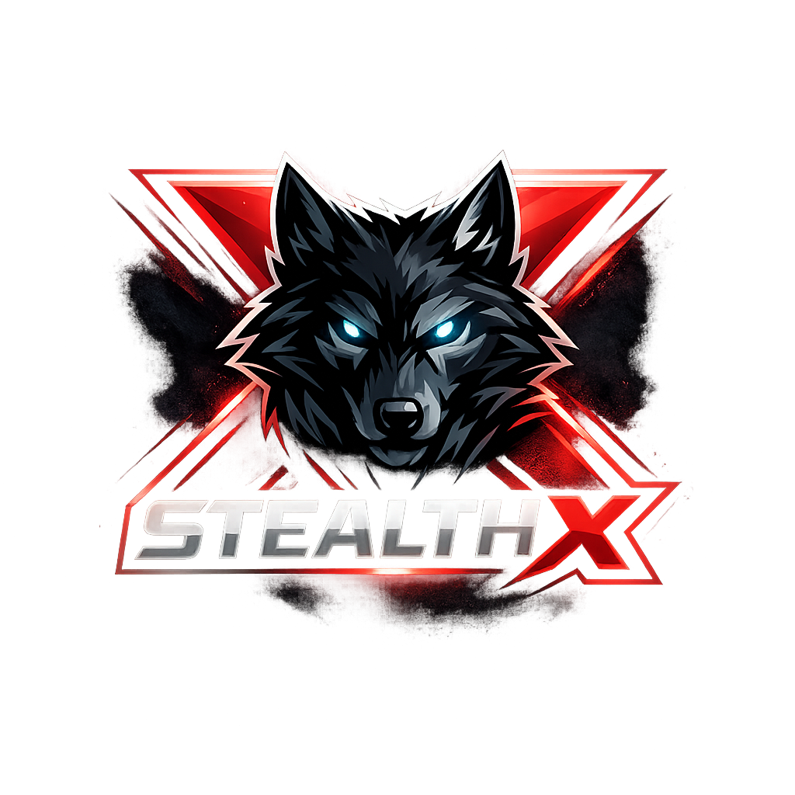

<!-- markdownlint-disable MD033 MD041 -->

# SecureCall

**End-to-End Encrypted Voice Calls**

*Powered by the StealthX Platform*

---

**SecureCall is a voice communication app built from the ground up for privacy.**
No metadata. No compromises. Every call is encrypted end-to-end using military-grade cryptography.

[Website](https://neabouli.github.io/stealth/) | [Features](#features) | [Security](#security) | [Documentation](#documentation) | [FAQ](#faq)

---

## Features

- **End-to-End Encryption** -- Every voice call is encrypted using XChaCha20-Poly1305 (AEAD). Keys never leave your device.
- **X25519 Key Exchange** -- Ephemeral Diffie-Hellman key agreement ensures perfect forward secrecy. Each call uses a unique session key.
- **Zero-Knowledge Architecture** -- The server facilitates connections but cannot decrypt calls. No call content, no metadata, no logs.
- **Anti-Recording Protection** -- Active detection of screen recording, microphone hijacking, and spy apps (Pro/Premium).
- **Rust Crypto Core** -- All cryptographic operations run in a native Rust library via JNI -- no Java crypto, no OpenSSL.
- **Source Available** -- The complete source code is publicly available for independent security review.

## Architecture

SecureCall consists of three core components:

| Component | Technology | Purpose |
|-----------|-----------|---------|
| **Android Client** | Kotlin / Java | User interface, audio capture, call management |
| **Crypto Engine** | Rust (via JNI) | XChaCha20-Poly1305, X25519, HKDF-SHA256 |
| **Signaling Server** | Node.js | Connection establishment, key exchange relay |

For technical details, see the [Architecture Overview](docs/ARCHITECTURE_OVERVIEW.md).

## Security

Security is not a feature -- it's the foundation. Our approach:

- **Independently auditable** -- All source code is publicly available.
- **No trust required** -- Verify the cryptographic implementation yourself.
- **Formal security audit** -- Read the full [Security Audit Report](docs/SECURITY_AUDIT_REPORT.md).
- **Security design** -- Review our [Security Design Document](docs/SECURITY_DESIGN.md).

Found a vulnerability? Please report it via [GitHub Issues](https://github.com/NeaBouli/stealth/issues).

See [SECURITY.md](SECURITY.md) for our full security policy.

## Documentation

Complete documentation is available in the [Wiki](https://github.com/NeaBouli/stealth/wiki) and the `docs/WIKI/` directory:

| Category | Pages |
|----------|-------|
| **User Docs** | [Installation Guide](docs/WIKI/Installation-Guide.md) · [User Manual](docs/WIKI/User-Manual.md) · [FAQ](docs/WIKI/FAQ.md) |
| **Security** | [Security Design](docs/WIKI/Security-Design.md) · [Audit Report](docs/WIKI/Security-Audit.md) · [Encryption Architecture](docs/WIKI/Encryption-Architecture.md) |
| **Developer** | [Architecture](docs/WIKI/Architecture.md) · [Build Instructions](docs/WIKI/Build-Instructions.md) · [API Docs](docs/WIKI/API-Documentation.md) |
| **Project** | [Roadmap](docs/WIKI/Roadmap.md) · [Changelog](docs/WIKI/Changelog.md) · [Known Issues](docs/WIKI/Known-Issues.md) |

## Download

<!-- TODO: Replace with actual Play Store link when published -->

*Coming soon to Google Play*

**Website:** [neabouli.github.io/stealth](https://neabouli.github.io/stealth/)

## Building from Source

> **This repository is Source Available, not Open Source.**
>
> You may NOT build, distribute, or sell this app yourself.
> Download the official app from Google Play Store only.
> The source code is published for security auditing and transparency.

See the [LICENSE](LICENSE) for full terms.

## Third-Party Services & Transparency

SecureCall uses the following third-party services. **All voice data is encrypted end-to-end on your device before any data leaves it.** No third party can read, intercept, or decrypt your call content.

| Service | Purpose | Data Access |
|---------|---------|-------------|
| **Railway.app** | Cloud hosting for the signaling server | Relays encrypted signaling messages only. Cannot decrypt calls. No call logs stored. |
| **Metered.ca** | TURN relay server for NAT traversal | Relays encrypted media packets when direct peer-to-peer connection fails. Cannot decrypt content. |
| **Google STUN** | NAT discovery (public IP detection) | Receives IP address only for connection setup. No call data transmitted. Standard WebRTC protocol. |
| **Firebase Cloud Messaging** | Push notifications for incoming calls | Delivers notification metadata only (caller name, session ID). No call content is transmitted via FCM. |
| **GitHub Pages** | Project website hosting | Static website only. No user data collected or processed. |

**Key guarantees:**

- The signaling server is **zero-knowledge** -- it facilitates connections but cannot decrypt any call content.
- TURN relay servers only see encrypted packets -- decryption keys exist only on the two call participants' devices.
- Firebase is used solely for push notification delivery when the app is in the background. Analytics and Crashlytics are disabled.
- No user data, call metadata, or communication content is shared with, sold to, or accessible by any third party.

For the full privacy policy, see [Privacy Policy](https://neabouli.github.io/stealth/privacy.html).

## FAQ

<strong>Why can't I build the app myself?</strong>

SecureCall is published under a source-available license. The code is open for inspection and security auditing, but compiling, distributing, or creating derivative works is not permitted. This ensures a single, verified distribution channel through the official app store listing.

<strong>How do I know the app is secure?</strong>

The complete source code is publicly available in this repository. We have conducted a comprehensive security audit (see the [Security Audit Report](docs/SECURITY_AUDIT_REPORT.md)) and welcome independent review by security researchers.

<strong>What data does the server see?</strong>

The signaling server only facilitates connection establishment. It relays encrypted key exchange messages and signaling data. All voice data is encrypted end-to-end -- the server cannot decrypt any call content. No metadata or call logs are stored.

<strong>What cryptographic algorithms are used?</strong>

- **Key Exchange:** X25519 (Curve25519 Diffie-Hellman)
- **Key Derivation:** HKDF-SHA256
- **Encryption:** XChaCha20-Poly1305 (AEAD)
- **Forward Secrecy:** Double Ratchet protocol
- **Implementation:** Native Rust via JNI (no Java/Android crypto APIs)

<strong>How can I report a security issue?</strong>

Please [open a GitHub Issue](https://github.com/NeaBouli/stealth/issues). See [SECURITY.md](SECURITY.md) for our full disclosure policy.

---

## Deutsch

### SecureCall -- Ende-zu-Ende verschluesselte Sprachanrufe

SecureCall ist eine Sprachkommunikations-App, die von Grund auf fuer Privatsphaere entwickelt wurde. Jeder Anruf wird mit XChaCha20-Poly1305 verschluesselt. Die Schluessel verlassen nie Ihr Geraet.

**Warum quelloffen?** Verschluesselungssoftware muss transparent sein. Sie sollten nie einer Blackbox Ihre privaten Gespraeche anvertrauen muessen. Der vollstaendige Quellcode ist oeffentlich einsehbar -- fuer unabhaengige Sicherheitspruefungen und Verifikation.

**Wichtig:** Dieser Code steht unter einer Source-Available-Lizenz. Er darf eingesehen und geprueft, aber nicht kompiliert, verteilt oder kommerziell genutzt werden.

- [Sicherheitsaudit-Bericht](docs/SECURITY_AUDIT_REPORT.md)
- [Architektur-Uebersicht](docs/ARCHITECTURE_OVERVIEW.md)
- [Sicherheitsdesign](docs/SECURITY_DESIGN.md)
- [Issue melden](https://github.com/NeaBouli/stealth/issues)

---

**SecureCall** is a product of the **StealthX** platform.

[Contributing](CONTRIBUTING.md) | [License](LICENSE) | [Code of Conduct](CODE_OF_CONDUCT.md) | [Security](SECURITY.md)

