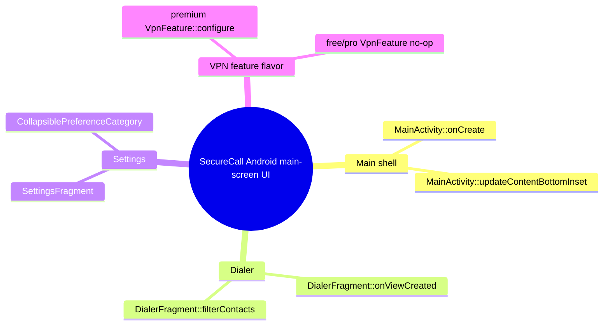

# Architecture map — Android client, main-screen UI lane (scope: issue #86)

Partial map. Only the lane touched by issue #86 is traced; the rest of the repository is
not mapped here.

## 1. Core idea

- StealthX/SecureCall is an Android client for end-to-end encrypted calls
  (`client_android/app/src/main/AndroidManifest.xml`, launcher `.MainActivity`).
- The user picks a tab in the bottom navigation, dials a number or Call ID, and starts a call
  (`MainActivity.java`, `ui/DialerFragment.kt`).
- Tier features are split by product flavor: `free`, `pro`, `premium` source sets
  (`app/build.gradle` `productFlavors`); the Premium direct-download build adds a VPN block
  to settings (`src/premium/.../vpn/VpnFeature.kt`).

## 2. Lane (hops)

1. `MainActivity::onCreate` → `activity_main.xml#bottomNav` (menu `bottom_nav_menu`): tab id.
2. `MainActivity::updateContentBottomInset` → `nav_host_fragment` bottom margin = bottom-nav
   height (+ visible ad banner height).
3. `bottomNav` `nav_dialer` → `DialerFragment::onCreateView` → `fragment_dialer.xml`
   (display, `contactSuggestions`, `dialPad` grid of `Widget.SecureCall.DialButton`,
   `btnToggleAlpha`, `fabCall`).
4. `DialerFragment::btnToggle` (ABC mode) → `InputMethodManager.showSoftInput`: IME resizes
   the window (`windowSoftInputMode=adjustResize`) with a visible-frame fallback for edge-to-edge.
5. `DialerFragment::filterContacts` → `contactSuggestions` visible with `ContactAdapter` rows.
6. `bottomNav` `nav_settings` → `SettingsFragment` → `preferences.xml`
   (`CollapsiblePreferenceCategory` sections) → `VpnFeature::configure` (flavor source set)
   appends `premium_vpn_category` to the preference screen.

## 3. Modules

| Module | One job | Entry | State |
| --- | --- | --- | --- |
| Main shell | tabs, toolbar, content insets | `MainActivity.java::onCreate` | built |
| Dialer | number entry, matches, start call | `ui/DialerFragment.kt::onViewCreated` | built |
| Settings | preference sections | `ui/SettingsFragment.kt` | built |
| Collapsible section | expand/collapse preference group | `ui/CollapsiblePreferenceCategory.kt` | built |
| VPN feature (flavor) | Premium VPN settings block | `src/{free,pro,premium}/.../vpn/VpnFeature.kt::configure` | built (premium), no-op (free/pro) |

## 4. Wiring

- `MainActivity` sizes `nav_host_fragment` above `bottomNav`; fragments must not reserve the
  bottom-nav height a second time.
- `DialerFragment` splits the remaining height by layout weights between matches and dial pad.
- The IME resizes the activity; the dialer also consumes any residual edge-to-edge overlap.
- `SettingsFragment` calls `VpnFeature.configure`; only the premium source set adds a category.

## 5. Contradictions and gaps (found for #86)

- `fabCall` keeps a 96dp bottom margin although hop 2 already offsets the content: dead space
  that squeezes the weighted dial pad to 42dp keys at 320x640dp (the 64dp `minHeight` is not
  honoured inside a weighted `GridLayout`). Two-line `0\n+` label is clipped at that height.
- `bottomNav` has no `labelVisibilityMode`; with four items Material shows only the selected label.
- No IME inset handling in hop 4: contact matches are drawn under the keyboard.
- `VpnFeature` (premium) appends a plain `PreferenceCategory`; peers use
  `CollapsiblePreferenceCategory`.

## 6. Diagrams

- `docs/architecture/map.puml` (mindmap + components), `docs/architecture/main-path.puml`
  (sequence). PlantUML is not installed on the authoring machine; sources are not rendered.

## 7. Next step (issue #86)

Modules Main shell (hop 1 layout attribute), Dialer (hops 3–5) and VPN feature (hop 6).
Untouched: networking, call, crypto, billing, `MainActivity.java`, `SettingsFragment.kt`,
free/pro `VpnFeature.kt`.
