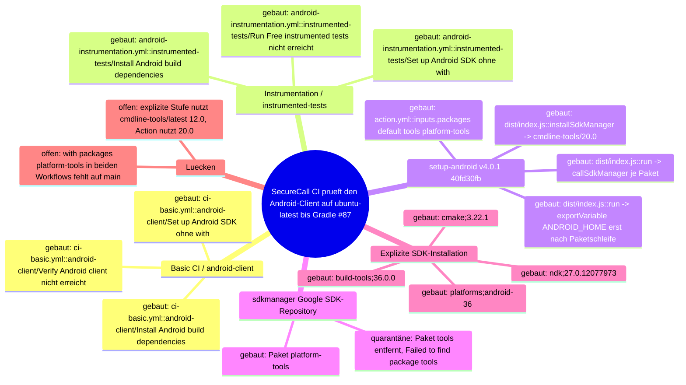

# Architektur-Karte — SecureCall CI / Android-SDK-Bootstrap (Issue #87)

Basis: `origin/main` `e06d018417bae5be16bf6b89d0a1887586a99d3b`. Kartierungslauf T-474, kein
Workflow- oder Produktcode geändert. Die Karte ist die Grenze des anschließenden #87-Fixes.

Diagramme: `docs/architecture/map.puml` (Mindmap + Komponenten),
`docs/architecture/main-path.puml` (Sequenz der gebauten Spur).

## 1. Grundidee

- SecureCall ist ein Android-Client mit Rust-Crypto-Core und Signaling-Backend
  (`docs/ARCHITECTURE_OVERVIEW.md` §2, §4.1).
- Basic CI prüft bei Push/PR u. a. den Android-Client mit Unit-Tests, VPN-Policy-Guards, Lint und
  signierten Free-Artefakten (`.github/workflows/ci-basic.yml::android-client`, Zeile 129 ff.).
- Instrumentation baut Free-Debug und führt Emulator-Smoke auf API 24/36 aus
  (`.github/workflows/android-instrumentation.yml::instrumented-tests`, Zeile 64 ff.).
- Beide Jobs hängen an einem Android-SDK-Bootstrap auf `ubuntu-latest`: gepinnte Action
  `android-actions/setup-android@40fd30fb… # v4.0.1`, danach expliziter `sdkmanager`-Schritt
  (`ci-basic.yml:118-127`, `android-instrumentation.yml:45-54`).
- Grenze dieser Karte: nur dieser Bootstrap bis zum Übergang an Gradle bzw. Emulator-Runner.
  Gradle, Android-Source, Signing und Release sind Nachbarn, nicht Spur.
- Issue #87 (offen): Bootstrap bricht mit `Failed to find package 'tools'` ab, bevor ein
  Repository-Gradle-Schritt läuft (Beleg: Actions-Run `35434962963`, Job `Android Client`).

## 2. Spur (Hop-Liste, nur geöffnete Hops)

| # | Hop | Datum über die Kante | Beleg |
| --- | --- | --- | --- |
| 1 | `ci-basic.yml::android-client/Set up Android SDK` → `setup-android action.yml::inputs` | kein `with:` → Input `packages` = Default `tools platform-tools` | `ci-basic.yml:118-119`; `action.yml@40fd30fb` `packages.default` |
| 1' | `android-instrumentation.yml::instrumented-tests/Set up Android SDK` → `setup-android action.yml::inputs` | identisch, kein `with:` | `android-instrumentation.yml:45-46` |
| 2 | `dist/index.js::run` → `dist/index.js::installSdkManager` | `cmdline-tools-version` `14742923`; vorinstalliertes `cmdline-tools/latest` ist `12.0` → „Wrong version“ → Download nach `cmdline-tools/20.0` | `dist/index.js` Z. 22753-22797; Run-Log 35434962963 |
| 3 | `dist/index.js::run` → `callSdkManager(sdkManagerExe, "--licenses")` | Lizenzannahme, exit 0 | Z. 22809-22812; Run-Log |
| 4 | `dist/index.js::run` → `callSdkManager(sdkManagerExe, "tools")` | `getInput("packages").split(" ")` → erstes Paket `tools` | Z. 22813-22820; Log: `…/cmdline-tools/20.0/bin/sdkmanager tools` |
| 5 | `sdkmanager` → `dist/index.js::run` | exit 1, `Warning: Failed to find package 'tools'` → `exec` wirft → `run()` rejected (kein `catch`) → Step-Failure | Log-Zeilen `Failed to find package 'tools'`, `failed with exit code 1` |
| 6 | Abbruch → nicht erreicht: `callSdkManager("platform-tools")`, `exportVariable("ANDROID_HOME"/"ANDROID_SDK_ROOT")`, `addPath` | — | Z. 22818-22826 (Reihenfolge nach der Paketschleife) |
| 7 | Nicht erreicht: `…/Install Android build dependencies` (`$ANDROID_HOME/cmdline-tools/latest/bin/sdkmanager` `platforms;android-36` `build-tools;36.0.0` `cmake;3.22.1` `ndk;27.0.12077973`) | — | `ci-basic.yml:121-127`, `android-instrumentation.yml:48-54` |
| 8 | Nicht erreicht: `ci-basic.yml::Verify Android client` (`./gradlew …`) bzw. `android-instrumentation.yml::Run Free instrumented tests` (`android-emulator-runner`) | — | `ci-basic.yml:129`, `android-instrumentation.yml:64` |

## 3. Module

| Modul | Eine Aufgabe | Einstieg | Stand |
| --- | --- | --- | --- |
| Basic CI / android-client | Android-Client bis signierter Free-Artefakte prüfen | `.github/workflows/ci-basic.yml::android-client/Set up Android SDK` | `gebaut` (bricht in Hop 5 ab) |
| Instrumentation / instrumented-tests | Free-Debug auf Emulator API 24/36 testen | `.github/workflows/android-instrumentation.yml::instrumented-tests/Set up Android SDK` | `gebaut` (gleiche Konfiguration wie Basic CI; Abbruch dort per Log nicht selbst geöffnet, siehe §5) |
| setup-android v4.0.1 (`40fd30fb`) | cmdline-tools bereitstellen, Pakete aus `packages` installieren, `ANDROID_HOME` exportieren | `dist/index.js::run` | `gebaut` (Default-Input `packages` enthält entferntes Paket) |
| sdkmanager (Google SDK-Repository) | SDK-Pakete auflösen und installieren | `cmdline-tools/20.0/bin/sdkmanager` | `gebaut`; Paket `tools`: `quarantäne` (vom Repository entfernt, Auflösung scheitert) |
| Explizite SDK-Installation | API 36, Build Tools 36.0.0, CMake 3.22.1, NDK 27.0.12077973 installieren | `…::Install Android build dependencies` | `gebaut` (auf main nicht erreicht; muss unverändert bleiben) |
| Gradle / Emulator-Runner | Repository-Build und Tests | `…::Verify Android client` / `…::Run Free instrumented tests` | `gebaut` (Nachbar, nicht Spur, nicht erreicht) |
| Packages-Override | Default-Input der Action auf `platform-tools` setzen | `with: packages: platform-tools` | `offen` (fehlt auf main in beiden Workflows) |

## 4. Verdrahtung

- `ci-basic.yml::android-client` → `setup-android`: Step `Set up Android SDK` ruft die Action ohne `with:`, also mit Default `packages: tools platform-tools`.
- `android-instrumentation.yml::instrumented-tests` → `setup-android`: identischer Aufruf, identischer Default.
- `setup-android::run` → `sdkmanager`: `callSdkManager` je Paket in Reihenfolge, zuerst `tools`.
- `sdkmanager` ⇢ `setup-android::run`: exit 1 für `tools`; die unbehandelte Rejection beendet den Step.
- `setup-android` ⇢ Explizite SDK-Installation: Übergabe von `ANDROID_HOME` findet nie statt, weil `exportVariable` erst nach der Paketschleife steht.
- Explizite SDK-Installation ⇢ Gradle/Emulator-Runner: nicht erreicht.
- Offene Kante (gestrichelt, nicht gebaut): `with: packages: platform-tools` an beiden `Set up Android SDK`-Steps.

```mermaid
mindmap
  root((SecureCall CI prueft den Android-Client auf ubuntu-latest bis Gradle #87))
    Basic CI / android-client
      gebaut: ci-basic.yml::android-client/Set up Android SDK ohne with
      gebaut: ci-basic.yml::android-client/Install Android build dependencies
      gebaut: ci-basic.yml::android-client/Verify Android client nicht erreicht
    Instrumentation / instrumented-tests
      gebaut: android-instrumentation.yml::instrumented-tests/Set up Android SDK ohne with
      gebaut: android-instrumentation.yml::instrumented-tests/Install Android build dependencies
      gebaut: android-instrumentation.yml::instrumented-tests/Run Free instrumented tests nicht erreicht
    setup-android v4.0.1 40fd30fb
      gebaut: action.yml::inputs.packages default tools platform-tools
      gebaut: dist/index.js::installSdkManager -> cmdline-tools/20.0
      gebaut: dist/index.js::run -> callSdkManager je Paket
      gebaut: dist/index.js::run -> exportVariable ANDROID_HOME erst nach Paketschleife
    sdkmanager Google SDK-Repository
      quarantäne: Paket tools entfernt, Failed to find package tools
      gebaut: Paket platform-tools
    Explizite SDK-Installation
      gebaut: platforms;android-36
      gebaut: build-tools;36.0.0
      gebaut: cmake;3.22.1
      gebaut: ndk;27.0.12077973
    Luecken
      offen: with packages platform-tools in beiden Workflows fehlt auf main
      offen: explizite Stufe nutzt cmdline-tools/latest 12.0, Action nutzt 20.0
```

## 5. Widerspruch und Lücken

- **Fix existiert bereits außerhalb von main.** Der offene PR #102 („Integrate reviewed SecureCall
  audit and release stack“, Head `5f70b16`) enthält genau `with: packages: platform-tools` in
  `ci-basic.yml:129-131` und `android-instrumentation.yml:46-47`. Instrumentation-Run
  `35512897743` auf diesem Head zeigt `packages: platform-tools` und `sdkmanager platform-tools`
  und endete `success`. Ein separater #87-Fix auf main würde denselben Hunk ein zweites Mal
  bauen; Codex entscheidet, ob #87 isoliert gemergt oder über #102 geschlossen wird
  (Audit-PR-Integration ist out-of-scope für T-474).
- **Zwei sdkmanager-Versionen.** Die Action lädt `cmdline-tools/20.0` und setzt diese in den
  `PATH`; der explizite Schritt ruft dagegen hart `$ANDROID_HOME/cmdline-tools/latest/bin/sdkmanager`
  (auf dem Runner vorinstalliert `12.0`, laut Run-Log 35434962963). Kein Teil von #87, auf dem
  #102-Head offenbar unkritisch, bleibt aber eine Lücke.
- **Instrumentation-Abbruch auf main-Konfiguration nicht per eigenem Log geöffnet.** Der
  `tools`-Abbruch ist nur für Basic CI (Run 35434962963) belegt. Für Instrumentation ist er aus
  identischem Pin und identischem Step abgeleitet; alle gesichteten Instrumentation-Runs
  (35485509339 … 35512897743) liefen bereits mit Override.
- **Nachbar, nicht Spur:** Run `35486820761` (Override vorhanden) scheiterte später in
  `Run Free instrumented tests` auf API 24 — gehört laut Issue-Akzeptanz zu „später Fehler
  separat belegen“, nicht zu #87.
- **Nachbar, nicht Spur:** `android-emulator-runner` erhält selbst `ndk`/`cmake`-Inputs
  (`android-instrumentation.yml:73-74`) zusätzlich zur expliziten Installation. Nicht geändert,
  nicht bewertet.
- Doku ↔ Einstieg: `docs/ARCHITECTURE_OVERVIEW.md` und `WORKFLOWS.md` beschreiben die CI nicht;
  kein Widerspruch, nur keine Doku-Quelle für diesen Hop.

## 6. Diagrammdateien

- `docs/architecture/map.puml` — Mindmap und Komponentendiagramm
- `docs/architecture/main-path.puml` — Sequenzdiagramm der gebauten (abbrechenden) Spur
- PlantUML lokal nicht installiert: Quellen geschrieben, nicht gerendert.

## 7. Nächster Schritt (genau ein #87-Fix)

- **Modul:** setup-android-Aufruf in beiden Workflow-Jobs.
- **Hop:** 1 / 1' — `Set up Android SDK` → `action.yml::inputs.packages`.
- **Änderung:** an beiden Steps `with:` + `packages: platform-tools` ergänzen; Action-Pin
  `40fd30fb… # v4.0.1` unverändert.
  - `.github/workflows/ci-basic.yml` nach Zeile 119
  - `.github/workflows/android-instrumentation.yml` nach Zeile 46
- **Unverändert bleiben:** beide `Install Android build dependencies`-Steps mit
  `platforms;android-36`, `build-tools;36.0.0`, `cmake;3.22.1`, `ndk;27.0.12077973`; alle
  Gradle-/Android-Dateien unter `client_android/`; Signing-, Emulator-, Upload-Steps; andere
  Workflows; Action-Versionen.
- **Vorher klären (Codex):** isolierter Fix vs. Übernahme aus PR #102 (siehe §5), damit kein
  zweiter Pfad entsteht.
- **Nachweis:** Basic-CI-Log zeigt `packages: platform-tools`, kein `sdkmanager tools`, Gradle
  startet; Instrumentation erreicht die API-24/36-Matrix.
