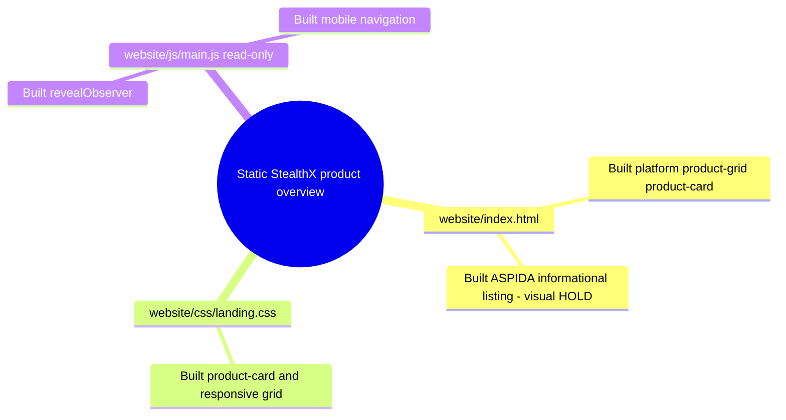

# ASPIDA website boundary

Task: `ASPIDA-WEBSITE-001`; inspected 2026-10-10. Accepted baseline: `296866f4189fe697d4a1af3e0aa226e252f2601a`. Built local candidate: `2282a8ef5d78215bec26b5e252ead3d70688e5fb`; visual acceptance PARTIAL/HOLD.

## 1. Ground idea

- StealthX presents its existing communication and privacy products on a static landing page (`website/index.html::#hero`, `#platform`).
- A visitor opens the platform section and reads product cards (`website/index.html::#platform > .product-grid`).
- The cards share the established StealthX design tokens and responsive surface styles (`website/css/landing.css:::root`, `.product-card`).
- Existing JavaScript reveals cards and manages mobile navigation; it implements no ASPIDA functionality (`website/js/main.js::revealObserver`, `navToggle`).
- The requested result is an informational ASPIDA listing explicitly marked in development, not a purchase, download or activation surface (`.fleet/tasks/ASPIDA-WEBSITE-001.md`).
- ASPIDA product execution, Android controls, finance and release readiness are outside this website boundary (`.fleet/tasks/ASPIDA-WEBSITE-001.md`).

## 2. Trace

Opened hops, all inspected 2026-10-10:

1. `website/index.html::#platform/.product-grid/.product-card` -> `website/css/landing.css::.product-grid/.product-card`: DOM classes, text and existing `--sx-*` accent values select the card layout and surfaces.
2. `website/index.html::.product-card.reveal` -> `website/js/main.js::revealEls/revealObserver`: existing `.reveal` elements are registered for viewport observation.
3. `website/js/main.js::revealObserver` -> `website/css/landing.css::.js .reveal.visible`: an intersecting element receives `visible`; CSS displays it without adding a second rendering path.
4. Direct navigation neighbor: `website/index.html::#navToggle/#navLinks` -> `website/js/main.js::navToggle click/link click` -> `website/css/landing.css::.sx-nav-links.active`: existing menu classes open and close the responsive navigation.

## 3. Modules

| Existing file/node | One responsibility | Entry | State |
| --- | --- | --- | --- |
| `website/index.html` / platform catalog | Present the static product overview | `#platform > .product-grid` | Built; ASPIDA informational listing present at `#aspida`; final visual gate HOLD |
| `website/css/landing.css` / product surfaces | Style existing cards and responsive grids | `.product-grid`, `.product-card` | Built; scoped ASPIDA contrast/anchor corrections present; final responsive/anchor proof pending |
| `website/js/main.js` / reveal and navigation | Apply existing reveal and mobile-menu state | `revealObserver`, `navToggle` | Built; read-only |

`website/js/launch-copy.test.cjs` is the existing static regression neighbor, not a new runtime module. Bounded ASPIDA guards are built; root verified 15 Node cases and 17 negative fixtures. This status update reruns no source tests.

## 4. Wiring

The landing document links `css/landing.css`; its platform classes choose the existing shared grid and card rules.
The document loads `js/main.js`; that script observes the existing `.reveal` classes.
The reveal observer adds `visible`, consumed by the existing CSS visibility rule.
The existing navigation IDs bind menu click handlers whose `active` state is consumed by responsive CSS.
No new JavaScript, provider, checkout route, Android module or product-runtime hop is mapped or authorized.

## 5. Contradictions and gaps

- The accepted catalog says “Three products. One security core.” ASPIDA must not be added to a claim of shared crypto, core, Suite or license; only the necessary family-heading/lead adjustment is authorized. The other three products and existing Suite terms remain unchanged.
- No ASPIDA icon exists in `website/assets/brand/`; do not relabel another product icon. Use a neutral text mark or existing umbrella brand only when clearly identified as StealthX.
- Owner-provided ASPIDA evidence is a static capability catalog only. Planned capabilities must remain planned; manually enabling Android system Sensors Off through OEM/developer settings is not an automatic ASPIDA master switch.
- Owner-provided project rollout is 23%; `PRODUCT_READY` is empty, `FINANCE_READY` is absent. None is changed by a static listing.
- Codex Security is NOT RUN. Access, destination/payload, exclusions and cost authorization remain pending; static tests or an independent review are not a scan.
- Final visual gate is PARTIAL/HOLD: retained pre-final contrast screenshots and the pre-fix 1180 anchor failure do not prove the final anchor correction, five-viewport matrix or mobile menu. Browser recovery returned no available browser; see [acceptance report](../../.fleet/reports/ASPIDA-WEBSITE-ACCEPTANCE-001.md).
- PlantUML is unavailable in PATH; sources are supplied, SVG rendering is NOT RUN.

## 6. Diagram paths

- `docs/architecture/map.puml` contains the existing-file mindmap and component diagram.
- `docs/architecture/main-path.puml` contains the same built visitor path.

```mermaid
mindmap
  root((Static StealthX product overview))
    website/index.html
      Built platform product-grid product-card
      Built ASPIDA informational listing - visual HOLD
    website/css/landing.css
      Built product-card and responsive grid
    website/js/main.js read-only
      Built revealObserver
      Built mobile navigation
```

## 7. Next step

Node `WEB.PLATFORM.ASPIDA` at hop 1 is built in the local candidate; scoped static review and guard remediation are accepted, not a Codex Security scan. Root Codex must resume the final in-app-browser responsive/anchor/menu gate before final integration or publication. `website/js/main.js`, other product terms, footer/company/Impressum, IFR controller, backend, Android, CI and configuration remain untouched. No deployment or visual PASS is authorized by this status update.
