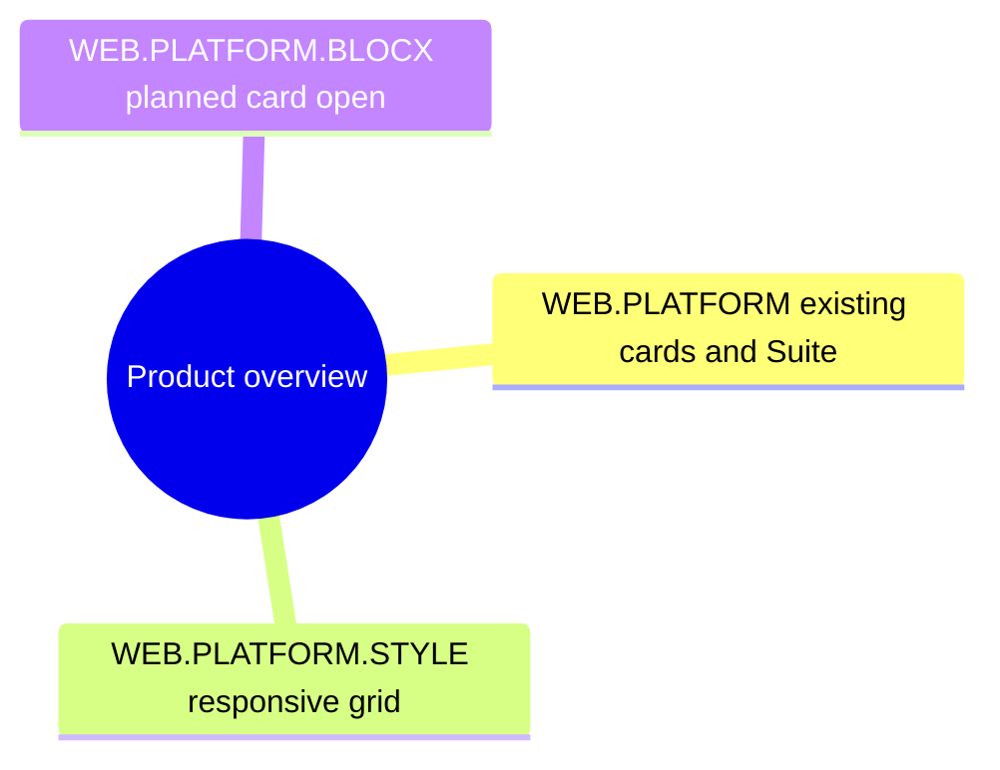

# StealthX product-overview map — 2026-10-10

## Purpose
The existing public landing page introduces the StealthX products. This bounded map covers only the platform product overview (website/index.html, website/css/landing.css). It does not map app, backend or payment flows.

## Trace and wiring
website/index.html::#platform -> .product-grid -> .product-card: static product names, descriptions and availability.
website/css/landing.css::.product-grid/.product-card -> responsive rendering: shared spacing, columns and card presentation.

## Modules
| Node | Responsibility | Entry | Status |
| --- | --- | --- | --- |
| WEB.PLATFORM | Present existing product cards and separate Suite summary | website/index.html::#platform | Built |
| WEB.PLATFORM.STYLE | Render the product overview responsively | website/css/landing.css::.product-grid | Built |
| WEB.PLATFORM.BLOCX | Present a distinct planned bLocX OS card | website/index.html::#platform | Open |

## Gaps and boundary
bLocX OS has no public product card yet. Product readiness and sales are unapproved. The new card is informational and separate from Suite; no app, payment, download, account, security claim or release flow is added.

```mermaid
mindmap
  root((Product overview))
    WEB.PLATFORM existing cards and Suite
    WEB.PLATFORM.STYLE responsive grid
    WEB.PLATFORM.BLOCX planned card open
```
## Diagrams and next step
Sources: map.puml and main-path.puml. Implement only WEB.PLATFORM.BLOCX at the existing HTML -> card -> CSS hop, then update its status; protect planned/non-purchase copy in website/js/launch-copy.test.cjs. Other product flows remain outside this map. The owner was shown this bounded hop before implementation.
